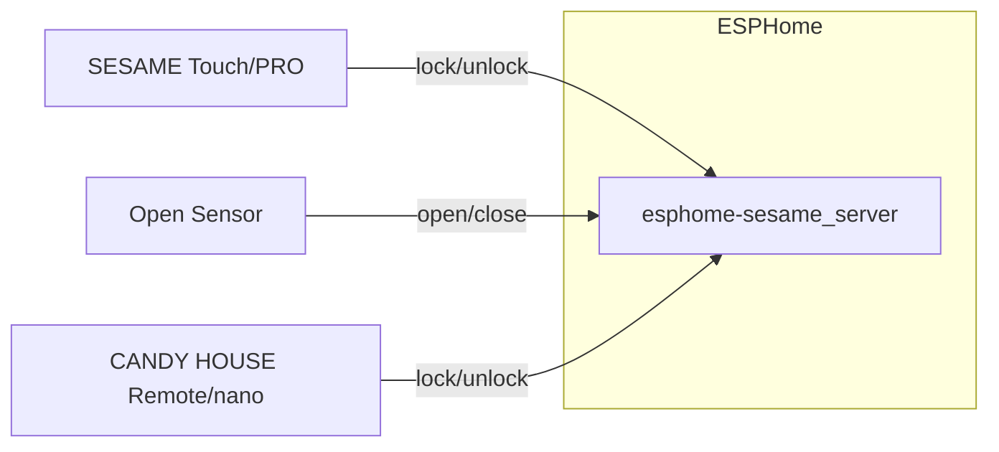
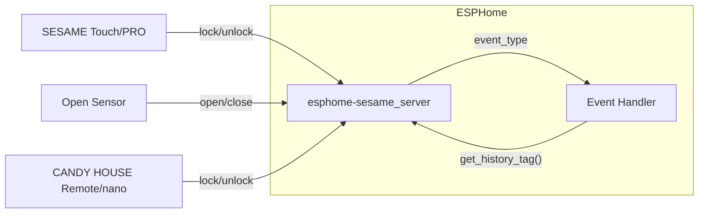
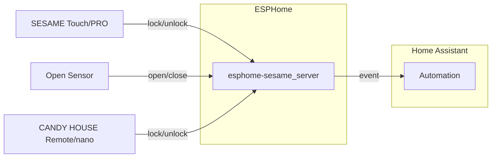
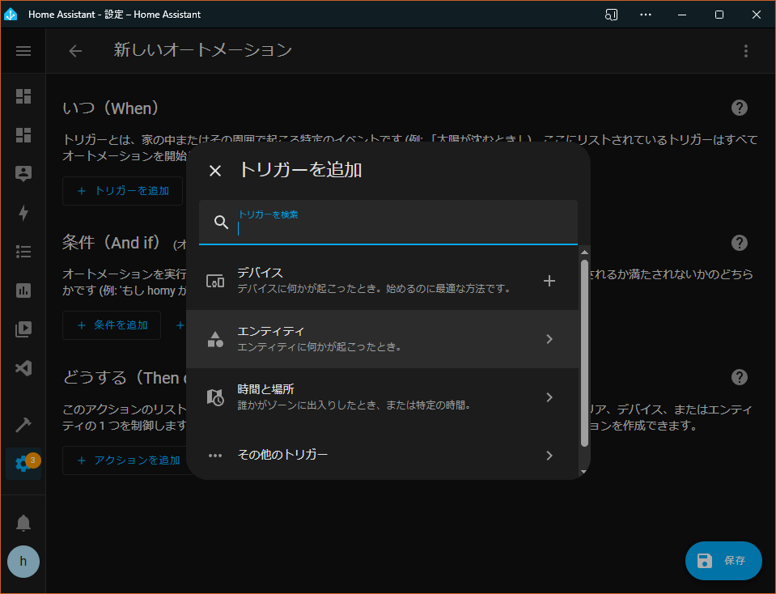
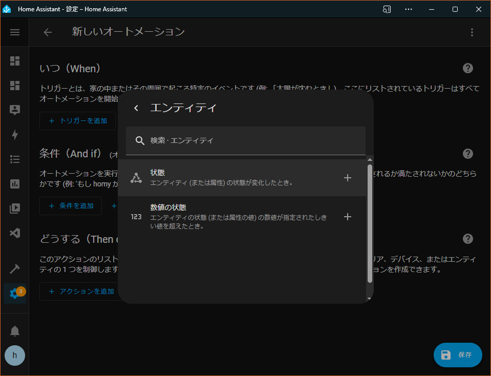
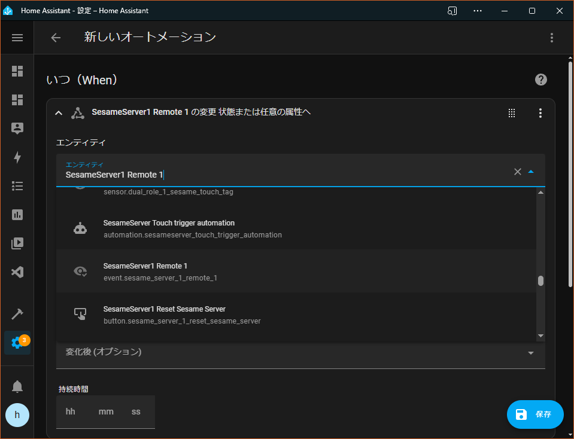
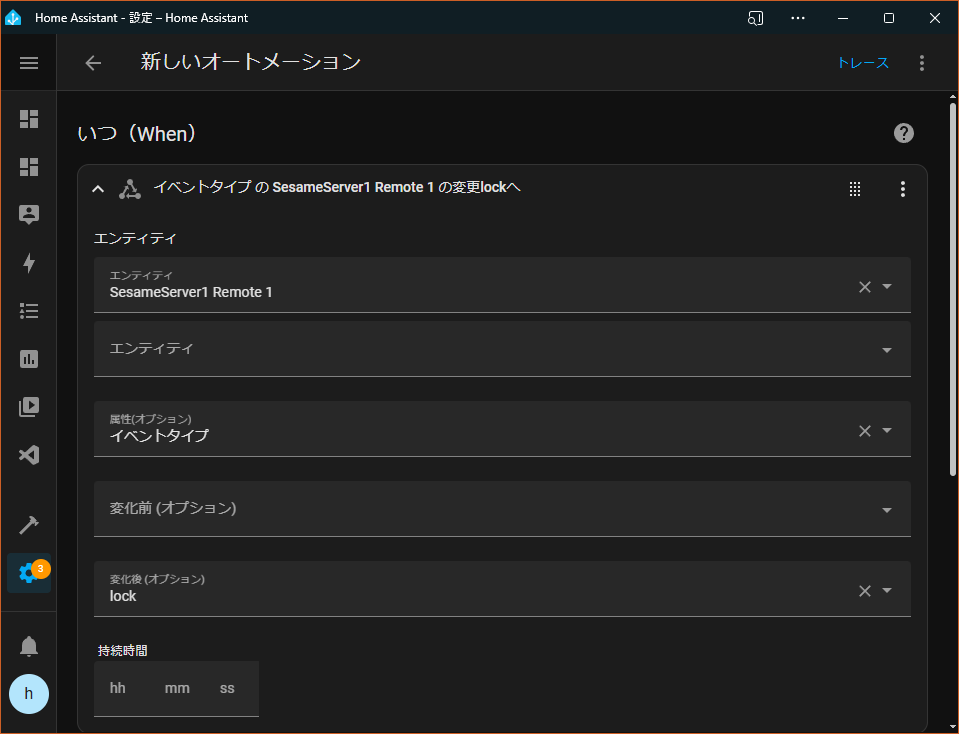
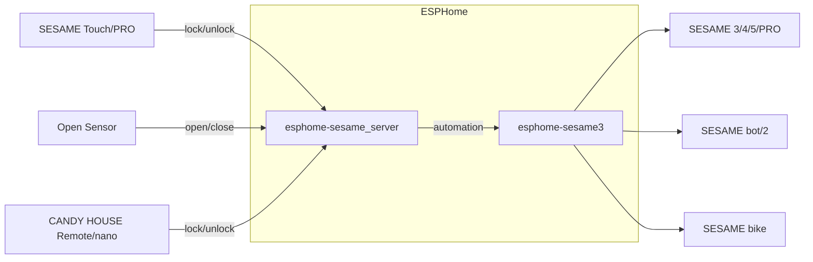

# esphome-sesame_server

[SESAME 5](https://jp.candyhouse.co/products/sesame5)のふりをして、[SESAME Touch](https://jp.candyhouse.co/products/sesame-touch)、[CANDY HOUSE Remote](https://jp.candyhouse.co/products/candyhouse_remote)、[オープンセンサー](https://jp.candyhouse.co/products/sesame-opensensor)等を押しボタンとして使用するための[ESPHome](https://esphome.io/)用コンポーネント



> [!注意] このコンポーネントはESPHomeに組込みのBluetooth機能をつかっていません。
> そのため、ESPHome用の他のBluetooth関連コンポーネントと同居することはできません。
> 両方を使いたい場合には別のESP32モジュールに搭載してください。

## 対応機種

* [SESAME Touch](https://jp.candyhouse.co/products/sesame-touch)
* [SESAME Touch PRO](https://jp.candyhouse.co/products/sesame-touch-pro)
* [CANDY HOUSE Remote](https://jp.candyhouse.co/products/candyhouse_remote)
* [CANDY HOUSE Remote nano](https://jp.candyhouse.co/products/candyhouse_remote_nano)
* [オープンセンサー](https://jp.candyhouse.co/products/sesame-opensensor)

## 必要なもの

* 適切(**重要**)なUUIDとBLEアドレスの組<br/>
不適切なUUIDとBLEアドレスの組を使用すると、Remote等のデバイスが接続してこないようです。私は故障したSESAME 5のUUIDとアドレスを使用しました。適切か否かの判定基準は不明です。Remote nanoのUUIDとアドレスの組も使用可能なようです。
* ESP32シリーズ<br/>
基本的に[Arduino core for ESP32](https://github.com/espressif/arduino-esp32)がサポートするESP32シリーズはどれでも動作すると思われます。私はArduino core v2.0系を使い、ESP32 C3やESP32 S3で動作確認しています。


# ESPHomeへの本コンポーネントの導入
本コンポーネントをESP32にインストールするにはESPHomeの[External Component](https://esphome.io/components/external_components.html)として導入します。以下がYAMLファイルの例です。また[サンプルファイル](../example.yaml)も参考にしてください。

```yaml
esphome:
  name: sesame-server-1
  friendly_name: SesameServer1
  platformio_options:
    build_flags:
    - -std=gnu++17 -Wall -Wextra
    - -DMBEDTLS_DEPRECATED_REMOVED
# Configure the maximum number of connections as required (maximum: 9)
    - -DCONFIG_BT_NIMBLE_MAX_CONNECTIONS=6
    - -DCONFIG_NIMBLE_CPP_LOG_LEVEL=0
    build_unflags:
    - -std=gnu++11
external_components:
- source:
    type: git
    url: https://github.com/homy-newfs8/esphome-sesame_server
    ref: v0.2.0
  components: [ sesame_server ]
# - source: '../esphome/esphome/components2'
#   components: [ sesame_server ]

esp32:
  board: esp32-s3-devkitc-1
  framework:
    type: arduino
```

ポイントは`external_components`セクションと`platformio_options`セクションです。`external_components`には本モジュールのURLを、`platformio_options`セクションには本モジュールをコンパイルするために必要な追加の設定を記述します。

同時に多数のSESAME TouchやRemoteと接続する場合には、`CONFIG_BT_NIMBLE_MAX_CONNECTIONS`の値を調整してください(最大9: 増やすほどメモリ使用量が増加します)。Open sensorやRemote nanoは操作した時にしか接続してこないので、同時接続数はある程度小さくても問題ないかもしれません。

`esp32`セクションはインストール先のESP32モジュールに応じて指定します。本コンポーネントでは`framework`として`arduino`を指定する必要があります。

# 本機のUUID、Bluetooth Addressの設定

前述したように、本機はSESAME 5のようにふるまいますが、SESAME TouchやCANDY HOUSE Remoteは特定のUUIDとBluetooth Address(以降単にAddress)の組み合わせを持ったデバイスにしか接続してこないように見えます。そこで、適切なUUIDとAddressを用意し、設定する必要があります。

```yaml
sesame_server:
  id: sesame_server_1
  address: "01:02:03:04:05:06"
  uuid: "12345678-1234-1234-1234-123456789abc"
```

`address`や`uuid`は上記のように直接書くか、ESPHomeの他のコンポーネントの設定と同様に別ファイルを参照させることも可能です([example.yaml](example.yaml)参照)。

`id`は必須ではありませんが、ESPHomeのイベントハンドラから本コンポーネントをターゲットとして呼び出すときに必要です(後述)。C++言語の識別子として適切な文字列を指定します。

## sesame_server設定変数
* **id** (*Optional*, string): コード生成に使用される識別子を任意に指定可能。
* **uuid** (**Required**, string): 本デバイス用UUID
* **address** (**Required**, string): 本デバイス用Bluetooth Address
* **max_sessions** (*Optional*, int): 最大同時セッション数。無指定の場合は3。変更する場合は`platformio_options`セクションの`CONFIG_BT_NIMBLE_MAX_CONNECTIONS`設定も見直したほうが良い。
* **triggers** (*Optional*): イベント処理対象のデバイスのリスト(次節)。

# 接続するデバイスの指定
本機が受け付けるSESAME TouchやRemoteのAddressを指定します。指定されていない機器からの接続も(認証が通る分には)許容しますが、ボタンを押してもイベントを発生させません。

```yaml
sesame_server:
  id: sesame_server_1
    ⋮
  triggers:
  - name: Sesame Touch 1
    id: touch_1
    address: !secret touch_1_address
    history_tag:
      id: touch_1_tag
      name: "Sesame_Touch_tag"
    on_event:
      then:
        - lambda: |-
            ESP_LOGD("example", "Event '%s'/'%s' triggered", event_type.c_str(), id(touch_1).get_history_tag().c_str());
  - name: Remote 1
    address: !secret remote_address
    on_event:
      then:
        - lambda: |-
            ESP_LOGD("example", "Event '%s' triggered", event_type.c_str());
```

`triggers`セクションには複数のデバイスをリストで指定します。デバイスひとつひとつは[Event](https://esphome.io/components/event/index.html)であり、それぞれにイベント受信時の処理(`on_event`)やHome Assistantで表示されるアイコン等を指定することができます。

`history_tag`は[Text Sensor](https://esphome.io/components/text_sensor/#base-text-sensor-configuration)で、SESAME Touch / SESAME Touch PROが通知してくるタグ値をHome Assistantに通知します。SESAME Touch系では指紋やカードにつけた名前が通知されるため、それらに応じて処理を分岐させることが可能です。

## trigger設定変数
* **id** (*Optional*, ID): コード生成に使用される識別子を任意に指定可能。
* **name** (*Optional*, string): イベント名。**id**または**name**のいずれかは必ず指定すること。
* **address** (**Required**, string): 接続元機器のBluetooth Address。
* **history_tag** (*Optional*, [Text Sensor](https://esphome.io/components/text_sensor/#base-text-sensor-configuration)): 接続元機器が通知してくるTAG文字列を公開するためのテキストセンサー。
* その他[Event](https://esphome.io/components/event/index.html)コンポーネントに指定可能な値。

### 利用デバイスのAddressを調べる
上記の`triggers`を指定していない場合でも本機へのコマンド送信が行なわれた場合にはログに接続元のAddressが出力されます。以下は`12:32:56:78:90:ab`から`unlock`コマンドを受信した場合の出力例です:

```
[15:52:36][W][sesame_server:050]: 12:34:56:78:90:ab: cmd=unlock(83), tag="Remote" received from unlisted device
```

また、[esphome-sesame3](https://github.com/homy-newfs8/esphome-sesame3)に含まれる`sesame_ble`を使うと、近くにあるSESAME TouchやCANDY HOUSE RemoteのAddressを調べることが可能です。

# 使用方法

1. ESPHomeを設定、コンパイルし起動する(`triggers`以下は未設定でも良い)。未登録デバイスとして動作を開始する。
1. スマホアプリを起動し&#x2295;を押すと本機が未登録SESAME 5として見えるので登録を実行する(適宜名称を変更すると良い)。
1. 本機へのイベントトリガーとして使用するRemote / Remote nano / Touch / Touch PRO / Open Sensorの設定画面を開き、「セサミを追加…」から前記で登録した本機を追加する(Remote nano / Open Sensorは要リセット)。
1. イベントトリガーのRemote等を操作すると本機へのコマンド送信が行なわれるのでログで確認する
1. ログに記載されているAddressを使って`triggers`セクションを設定する

## イベントハンドラで利用可能な情報


イベントハンドラ(`on_event`)内では以下の情報を利用可能です。
- event_type(イベントタイプ): [Event](https://esphome.io/components/event/index.html)で定義されている文字列。Remote / Touch / スマホ からコマンドを受信した場合は "lock" / "unlock"、 Open Sensorからコマンドを受信した場合は "open" / "close" です。
- get_history_tag(): イベントハンドラに記述した[Lambda](https://esphome.io/cookbook/lambda_magic.html)コードでトリガーの`id`を使って呼び出すことで、TAG値を取得することが可能です。TAG値はトリガーとなるデバイスによって以下のようになります。
  - SESAME Touch: 指紋、カードに名前が登録してあればその名前、未登録であれば "SESAME Touch"
  - SESAME Touch PRO: 不明(所有していません)
  - Remote: "Remote"
  - Remote nano: "Remote Nano"
  - Open Sensor: "Open Sensor"
  - スマホ: アプリの「自分」に登録してある名前

記述方法は[example.yaml](../example.yaml)を参考にしてください。

### RemoteでLチカ

```yaml
sesame_server:
  id: sesame_server_1
  address: !secret sesame_server_my_address
  uuid: !secret sesame_server_my_uuid
  triggers:
  - name: Remote 1
    address: !secret remote_address
    on_event:
      then:
        - lambda: |-
            if (event_type == "lock") {
              id(led_1).turn_on();
            } else {
              id(led_1).turn_off();
            }

output:
  - platform: gpio
    id: led_1
    pin: GPIO21
    id: gpio_d1
```
上記コードはGPIO21番ピンにLEDが接続されていることを想定しています(Seeed XIAO ESP32S3)。

### Home Assistantとの連携



Home Assistantではボタンが押されたことはエンティティの状態変更として通知されます。オートメーションの編集画面からトリガー追加 > エンティティ > 状態 と選択しトリガーの編集画面を開きます。




トリガー編集画面では ESPHome で定義したエンティティを選択し、属性として「イベントタイプ」、変化後の属性値に検知したいイベントタイプ(`lock`/`unlock`/`open`/`close`)を指定します。





## デュアルロール利用

本コンポーネントと[esphome-sesame3](https://github.com/homy-newfs8/esphome-sesame3)を使うと、一台のESP32でSESAMEへ命令を発行するクライアント機能と、Remote等のイベントをトリガーとして受信するサーバー機能の両方を共存させることが可能です。



Touchに特定の名前を付けたカードがかざされた時に別のセンサーのデータを確認してからSESAMEを開錠する、といったことが1台のESP32で(クラウドに頼らずに)実現可能になります。[dual-role.yaml](../dual-role.yaml)を参照してください。

### デュアルロール時の注意点

デュアルロール構成にすると、SESAME Touchからのトリガーを待ち受けつつ、そのSESAME Touchのバッテリー残量を監視するといったことも可能になります。ただし、SESAME Touchが(トリガー通知のために)本機(ESP32)に接続してきている状態においては、バッテリー残量を問合わせるために本機からそのSESAME Touchへ接続することができません。そこで、バッテリー残量を取得する際にはサーバー側の接続を一旦切断してから問合せを実行します。問合わせ実行中(数秒程度)はサーバーのアドバタイジングも停止するためSESAME Touchからのトリガーを受けることができません。問合わせが完了すればトリガーの受付けが可能になります。

そのようにクライアント側接続は一時的なものとする必要があるため、`always_connect`属性は`False`に設定する必要があります。バッテリー監視を低頻度にするため`update_interval`を長期間に設定することをお薦めします。また、SESAME TOuch等の使用がない時間に問合わせたいならば、`update_interval`を`never`に設定し、`time`コンポーネントの`on_time`イベントでバッテリー残量の問合わせを実行するのも良いでしょう。[dual-role.yaml](../dual-role.yaml)に例があります。


## 未登録状態へのリセット
`sesame_server.reset()`を呼び出すことで未登録状態にすることが可能です。[example.yaml](../example.yaml)にHome Assistant上に表示され、クリックすると初期化する疑似ボタンコンポーネントの定義をしてあります。参考にしてください。

```yaml
button:
- platform: template
  name: "Reset Sesame Server"
  on_press:
  - lambda: |-
      id(sesame_server_1).reset();
```
